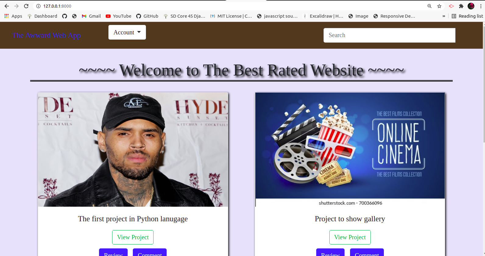

# M-Awward
## Contributors
If you have any queries or suggestions, feel free to connect with me over email. moseskinyua12@gmail.com

## Author
Mugo Moses

## Description
M-Awword is a web app that allows users to view posted projects and their details. User can also rate/ review other user's project, search for project, veiw projects overall score and also veiw the profile page. 

## Screenshots

## Setup and Installation
### Requirements
1. Clone the repository by running

        https://github.com/Moses-254-Mugo/M-Awwards
    Navigate to the project

        cd M-Awward
 2. Create a virtual enviroment

         pip install virtualenv 

    To activate the created virtual environment, run

        source virtual/bin/activate
3. Create database
    You will need to create a new postgress database by typing the following command to access postgress

        $ psql

    Then run below query to create a new database named 

        # create databases awardsdb;
5. Create Database migrations
    make migrations on postgres using django

        python3.8 manage.py makemigrations garage M-Awward
    then run the below command.

        python3.8 manage.py migrate

6. Run the app
    To run the application on your development machine,

        pythong3.8 manage.py runserver
### Running Tests
To run tests;

        python3.8 manage.py test

## Technologies Used
* Python3.8
* Django
* HTML
* Bootstrap
* CSS

## User Stories
1. View posted projects and their details
2. Post a project to be rated/reviewed
3. Rate/ review other users' projects
4. Search for projects 
5. View projects overall score
6. View my profile page

## Support and contact details
If you have any questions, want to contribute to the code? Please email at
moseskinyua12@gmail.com

## License
The project is under[MIT License](LICENSE).